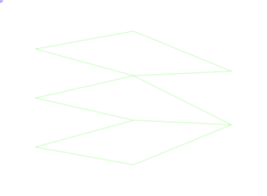
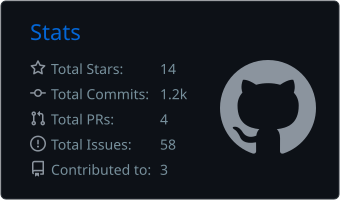
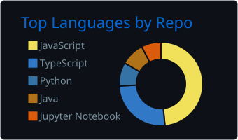
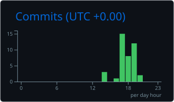
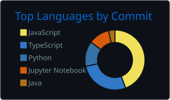
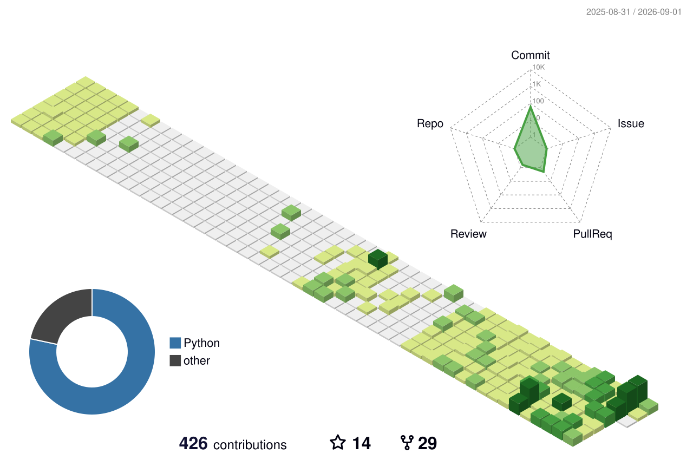

<div align="center">
  

  <a href="https://github.com/vipulpathak113">
    
  </a>

  <p>
    <a href="https://www.linkedin.com/in/vipulpathak113/"></a>
    <a href="https://github.com/vipulpathak113?tab=followers"></a>
    <a href="https://app.daily.dev/Vipul_Pathak"></a>
  </p>
</div>

---

## 💻 `$ whoami`

<!--START_SECTION:uptime-->
```bash
$ whoami
vipul --frontend-engineer --genai-builder

$ cat ~/about.md
> Frontend engineer who fell down the LLM rabbit hole — and stayed.
> Building agents, MCP servers and RAG pipelines that actually ship.
> Believes chatbots deserve good UX too.

$ uptime --fun
348+ hrs of code time · 6.22M lines written · 98% AI co-authored · humor module: enabled
```
<!--END_SECTION:uptime-->

<br/>



## 🧠 `$ pip list | grep -iE "ai|llm"`

> Everything below is pulled straight from my public repos — no vaporware badges. 🙂

**🤖 LLM Orchestration**


**🔎 RAG & Vector Search**


**🔬 Classic ML / DL**


**🛠️ AI App Tooling**


**👻 My AI copilots** *(per WakaTime, I'm ~99% AI co-authored 😅)*


`concepts:`        

<details open>
<summary><b>📂 $ ls ~/shipped-with-ai/</b> <i>— receipts, not vibes</i></summary>
<br/>

| Build | What it does | Powered by |
|---|---|---|
| [**langgraph-chatbot**](https://github.com/vipulpathak113/langgraph-chatbot) | Chatbot with memory, human-in-the-loop & persistence | `LangGraph` `LangChain` `MCP` `sqlite-vec` |
| [**expense-tracker-mcp-server**](https://github.com/vipulpathak113/expense-tracker-mcp-server) | Track expenses conversationally over MCP | `Python` `MCP` |
| [**MedicalAIBot**](https://github.com/vipulpathak113/MedicalAIBot) | Medical Q&A bot grounded with RAG | `LangChain` `FAISS` `HuggingFace` |
| [**restaurantName-lang-chain**](https://github.com/vipulpathak113/restaurantName-lang-chain) | Restaurant name + menu generator | `LangChain` `HuggingFace` |
| [**tensorFlow**](https://github.com/vipulpathak113/tensorFlow) | Handwritten digit recognition (MNIST) | `TensorFlow.js` |
| [**Object-Detection**](https://github.com/vipulpathak113/Object-Detection) | Live object detection in the browser | `COCO-SSD` `TF.js` `React` |
| [**Image-Classification**](https://github.com/vipulpathak113/Image-Classification) | MobileNet image classifier | `ML5.js` |
| **chatbot-backend + chatbot-frontend** 🔒 | Active build — LLM assistant service + React client | `LangGraph` `LLMs` `React` |
| **ai-journey** 🔒 | GenAI experiments, notes & model playground | `Python` |
| **chatbot-backend + chatbot-frontend** 🔒 | Active build — LLM assistant service + React client | `LangGraph` `LLMs` `React` |
| **ai-journey** 🔒 | GenAI experiments, notes & model playground | `Python` |

</details>

---


## 📦 `$ tree ~/stack/`

<details open>
<summary><b>⚛️ frontend/</b> — <i>where the pixels obey me</i></summary>
<br/>


</details>

<details open>
<summary><b>🧪 testing-&-build/</b> — <i>trust, but verify (with Jest)</i></summary>
<br/>


</details>

<details open>
<summary><b>🗄️ backend/</b> — <i>REST easy, my APIs have you covered</i></summary>
<br/>


</details>

<details open>
<summary><b>📱 mobile/</b> — <i>one JS codebase, many rectangles</i></summary>
<br/>


</details>

<details open>
<summary><b>☁️ cloud-&-devops/</b> — <i>it works on my cluster</i></summary>
<br/>


</details>

<details open>
<summary><b>🔤 languages/</b></summary>
<br/>


</details>

---

## 🚀 `$ git log --oneline --featured`

| Repo | What it does | Stack |
|---|---|---|
| [**langgraph-chatbot**](https://github.com/vipulpathak113/langgraph-chatbot) | Agent with memory, human-in-the-loop & persistence | `LangGraph` `LangChain` `MCP` |
| [**expense-tracker-mcp-server**](https://github.com/vipulpathak113/expense-tracker-mcp-server) | Expenses, but make them conversational | `Python` `MCP` |
| [**MedicalAIBot**](https://github.com/vipulpathak113/MedicalAIBot) | Medical Q&A with retrieval-grounded answers | `FAISS` `HF` `Streamlit` |
| [**shopping-mfe**](https://github.com/vipulpathak113/shopping-mfe) | E-commerce split into micro-frontends (+ cart/product/about siblings) | `React` `Module Federation` |
| [**react-unit-testing**](https://github.com/vipulpathak113/react-unit-testing)  | Jest + RTL patterns that made testing click | `Jest` `RTL` |
| [**FrontendInterviewQuestions**](https://github.com/vipulpathak113/FrontendInterviewQuestions)  | Frontend interview bank, community-approved | `JavaScript` |
| [**vscode-portfolio**](https://github.com/vipulpathak113/vscode-portfolio) | My portfolio disguised as a VS Code window | `React` |
| [**set-state-callback**](https://github.com/vipulpathak113/set-state-callback) | Published npm package — setState callback ergonomics for hooks | `npm` `React` |
| [**react-accessibility**](https://github.com/vipulpathak113/react-accessibility) | Live accessibility best-practices reference site | `TypeScript` `A11y` |

---

## 📊 `$ htop --sort-key=PANACHE`

> 💡 stats below are generated **inside this repo** by GitHub Actions — no flaky third-party services.

<div align="center">
<table><tr>
<td></td>
<td></td>
</tr><tr>
<td></td>
<td></td>
</tr></table>


<details>
<summary><b>🏙️ <code>$ open ~/profile-city.dae</code></b> <i>— my contributions as a 3D city</i></summary>
<br/>

</details>
</div>

---

## 🐍 `$ ./snake --eat=my-contributions`

<div align="center">
<picture>
  <source media="(prefers-color-scheme: dark)" srcset="https://raw.githubusercontent.com/vipulpathak113/vipulpathak113/output/github-snake-dark.svg" />
  
</picture>
</div>

---

## ⏱️ `$ tail -f /var/log/dev-metrics.log`

<!--START_SECTION:waka-->


**🐱 My GitHub Data** 

> 📦 397.4 kB Used in GitHub's Storage 
 > 
> 🏆 370 Contributions in the Year 2026
 > 
> 💼 Opted to Hire
 > 
> 📜 87 Public Repositories 
 > 
> 🔑 4 Private Repositories 
 > 
**I'm a Night 🦉** 

```text
🌞 Morning                87 commits          █░░░░░░░░░░░░░░░░░░░░░░░░   03.90 % 
🌆 Daytime                322 commits         ████░░░░░░░░░░░░░░░░░░░░░   14.45 % 
🌃 Evening                1230 commits        ██████████████░░░░░░░░░░░   55.18 % 
🌙 Night                  590 commits         ███████░░░░░░░░░░░░░░░░░░   26.47 % 
```
📅 **I'm Most Productive on Thursday** 

```text
Monday                   298 commits         ███░░░░░░░░░░░░░░░░░░░░░░   13.37 % 
Tuesday                  341 commits         ████░░░░░░░░░░░░░░░░░░░░░   15.30 % 
Wednesday                297 commits         ███░░░░░░░░░░░░░░░░░░░░░░   13.32 % 
Thursday                 383 commits         ████░░░░░░░░░░░░░░░░░░░░░   17.18 % 
Friday                   341 commits         ████░░░░░░░░░░░░░░░░░░░░░   15.30 % 
Saturday                 204 commits         ██░░░░░░░░░░░░░░░░░░░░░░░   09.15 % 
Sunday                   365 commits         ████░░░░░░░░░░░░░░░░░░░░░   16.38 % 
```


📊 **This Week I Spent My Time On** 

```text
🕑︎ Time Zone: Asia/Kolkata

💬 Programming Languages: 
Markdown                 15 hrs 23 mins      ████████░░░░░░░░░░░░░░░░░   33.33 % 
TypeScript               8 hrs 52 mins       █████░░░░░░░░░░░░░░░░░░░░   19.24 % 
Python                   6 hrs 33 mins       ████░░░░░░░░░░░░░░░░░░░░░   14.22 % 
JavaScript               5 hrs 32 mins       ███░░░░░░░░░░░░░░░░░░░░░░   12.00 % 
Other                    5 hrs 8 mins        ███░░░░░░░░░░░░░░░░░░░░░░   11.15 % 

🔥 Editors: 
VS Code                  45 hrs 49 mins      █████████████████████████   99.28 % 
Opencode Cli             20 mins             ░░░░░░░░░░░░░░░░░░░░░░░░░   00.72 % 

🐱‍💻 Projects: 
ai-journey               24 hrs 14 mins      █████████████░░░░░░░░░░░░   52.52 % 
chatbot-backend          14 hrs 56 mins      ████████░░░░░░░░░░░░░░░░░   32.37 % 
chatbot-frontend         6 hrs 2 mins        ███░░░░░░░░░░░░░░░░░░░░░░   13.08 % 
vipulpathak113           56 mins             █░░░░░░░░░░░░░░░░░░░░░░░░   02.03 % 

💻 Operating System: 
Mac                      46 hrs 9 mins       █████████████████████████   100.00 % 
```

🤖 **AI Coding This Week** 

```text
⏱ AI Coding Time: 45 hrs 20 mins (98.25%)

✍️ 14,409 lines written by AI, 228 lines written by hand (98.44% AI-written)

🔤 57,170,507 Input Tokens, 1,983,646 Output Tokens

💵 $3102.53 Estimated AI Cost This Week

🧠 108 AI Sessions, 520 AI Prompts

Opencode-Cli             14,039 lines        ███████████████████████░░   92.12 % 
Deepseek                 1,177 lines         ██░░░░░░░░░░░░░░░░░░░░░░░   07.72 % 
Mimo                     16 lines            ░░░░░░░░░░░░░░░░░░░░░░░░░   00.10 % 
Gemini                   8 lines             ░░░░░░░░░░░░░░░░░░░░░░░░░   00.05 % 

🔎 AI Coding Insights:
🤖 AI-Driven — 98.44% of written lines came from AI
📄 Detailed Prompter — average 1,043 characters per prompt
🔁 Iterative Prompter — average 5 prompts per session
🚀 High AI Trust — 1.55% of changed lines were hand-edited
```

**I Mostly Code in JavaScript** 

```text
JavaScript               39 repos            ████████████░░░░░░░░░░░░░   47.56 % 
TypeScript               19 repos            ██████░░░░░░░░░░░░░░░░░░░   23.17 % 
Python                   7 repos             ██░░░░░░░░░░░░░░░░░░░░░░░   08.54 % 
Jupyter Notebook         5 repos             ██░░░░░░░░░░░░░░░░░░░░░░░   06.10 % 
MDX                      1 repo              ░░░░░░░░░░░░░░░░░░░░░░░░░   01.22 % 
```


**Timeline**


 Last Updated on 27/08/2026 07:56:59 UTC
<!--END_SECTION:waka-->

---

## 💬 `$ fortune | cowsay`


---

<div align="center">


<a href="https://github.com/vipulpathak113"></a>

<br/><br/>

<a href="https://app.daily.dev/Vipul_Pathak"></a>

<br/><br/>

<code>$ git commit -m "thanks for scrolling ✨"</code>

</div>
